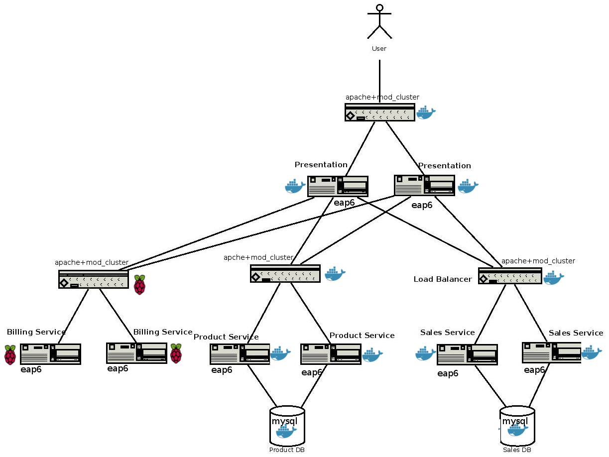

# Microservices 
MSA Demos using EAP

##Pre-requisite
1. Register to http://jboss.org f you are not already, this will allow you to download EAP6.4.0.zip
2. Clone this repo:<pre><code>git clone https://github.com/bgeorges/microservices.git</pre></code>
3. Go to the Docker directory<pre><code>cd eap/docker</pre></code>
4. run: <pre><code>build.sh</pre></code>
5. run: <pre><code>start_all_docker.sh</pre></code>

## Architecture Overview

## Detailed Delpoyment  

